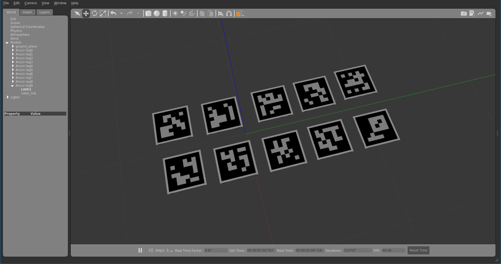

# gazebo aruco tag generator


## Dependencies

- opencv
- opencv-contrib (aruco)
- python
  - argparse
  - numpy
  - os

## How to use
For generate the tags:
```bash
$ python create_aruco.py --num 10
```

Quick test:
```bash
$ cd /repo_root
$ export GAZEBO_MODEL_PATH=$GAZEBO_MODEL_PATH:$PWD/models
$ gazebo --verbose empty.world
```
